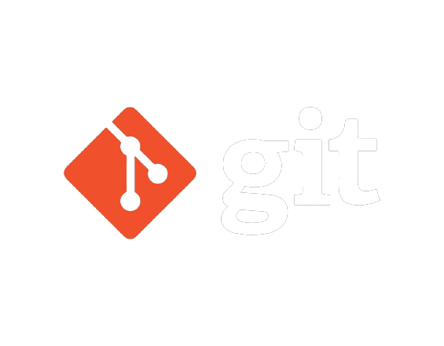
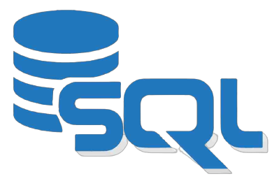

<h1> Hey, I’m Aman </h1>

 

✨ Raw data whisperer in training 
  
  👀 I am an Artificial Intelligence and Data Engineering enthusiast 
  🤖 Building pipelines, cleaning chaos, turning bytes into insights 
  🫂 Seeking collaborators & feedback to build data dreams!  
  📫 Hit me up: amanparasher.ai@gmail.com   
  
Let's engineer a better tomorrow!
 

  

 
 
 

  

 

## 👩‍💻 Tech Stack
### Languages and tools I work with

 

 

### Python libraries I expertise in

<!---
amanparasher/amanparasher is a ✨ special ✨ repository because its `README.md` (this file) appears on your GitHub profile.
You can click the Preview link to take a look at your changes.
--->
